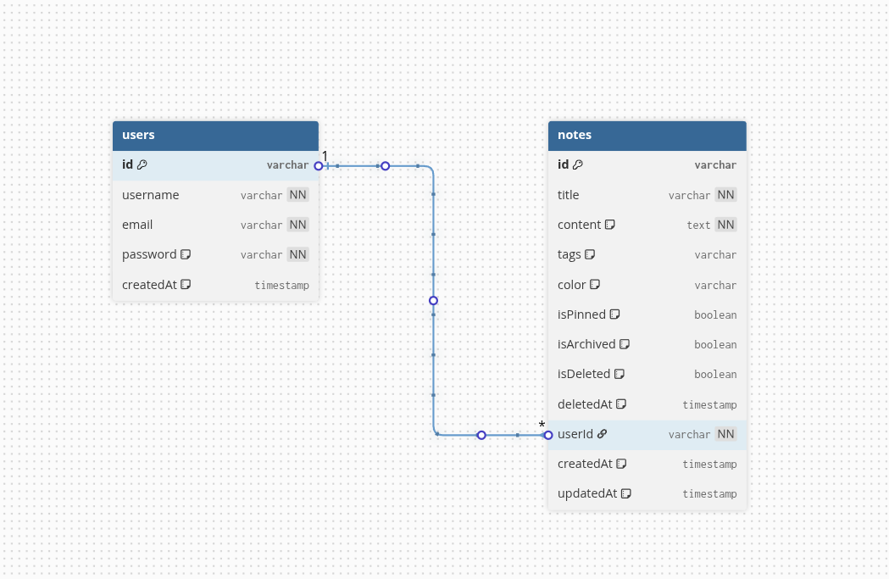

# 📝 DailyNotes

**DailyNotes** is a modern, full-stack note-taking application built using the **MERN Stack (MongoDB, Express, React, Node.js)**. It offers a seamless experience for users to create, edit, delete, search, and pin important notes, ensuring an efficient and organized workflow. 

**Live Demo:** [DailyNotes Web Application](https://dailynotes-alikhere.vercel.app)

## Getting Started

You can run the DailyNotes locally using either of the following methods:
- [Setup Instructions](/Setup-Instruction.md)
- [Docker Instructions](/Docker-Instruction.md)

## ✨  Key Features
- **User Authentication**: Secure login and sign-up to manage notes individually.
- **Create Notes**: Add new notes with an intuitive interface.
- **Edit & Delete Notes**: Update or remove notes as needed.
- **Pin Notes**: Keep important notes at the top for quick access.
- **Search Notes**: Quickly search through your notes.
- **Responsive UI**: Fully responsive design that works across all screen sizes.

## 📸 Screenshots  

  
  

  
  

## 🚀 Tech Stack

### Highlights

- **Frontend with React.js (Vite)**: A fast and optimized frontend framework for dynamic UI development.
- **Backend with Node.js & Express.js**: API server for handling requests, authentication, and data management.
- **Database with MongoDB**: NoSQL database for storing user data and notes.
- **Authentication with JWT (JSON Web Tokens)**: Secure user authentication and session management.
- **Styling with Tailwind CSS**: A utility-first CSS framework for building modern and responsive UIs.

| Technology                          | Description                                                                                         |
| ------------------------------------ | --------------------------------------------------------------------------------------------------- |
| [**React.js (Vite)**](https://reactjs.org/) | Frontend framework to build fast and dynamic web applications.                                      |
| [**Node.js (Express.js)**](https://nodejs.org/) | Backend server for handling API requests, authentication, and interacting with the database.        |
| [**MongoDB**](https://www.mongodb.com/) | NoSQL database to store user data, notes, and tags.                                                |
| [**JWT (JSON Web Tokens)**](https://jwt.io/) | Secure user authentication using token-based sessions.                                            |
| [**Tailwind CSS**](https://tailwindcss.com/) | A utility-first CSS framework for rapid UI development.                                             |

## Database Schema

## CI/CD Pipeline

