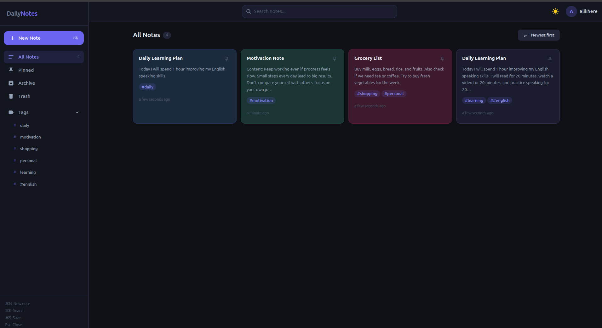
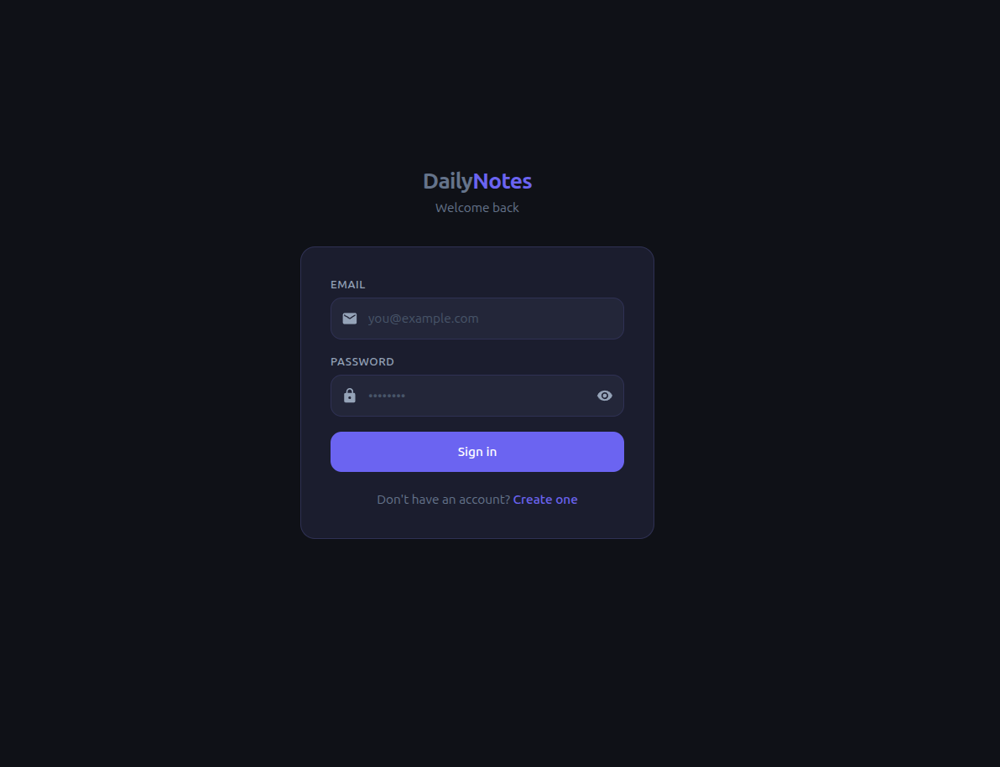
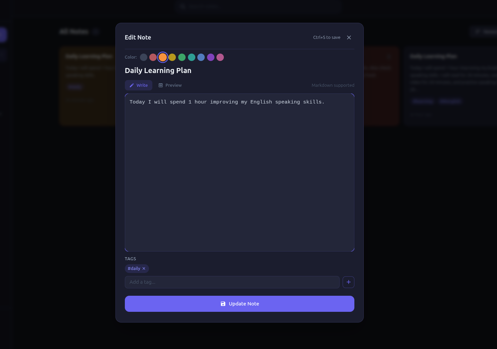
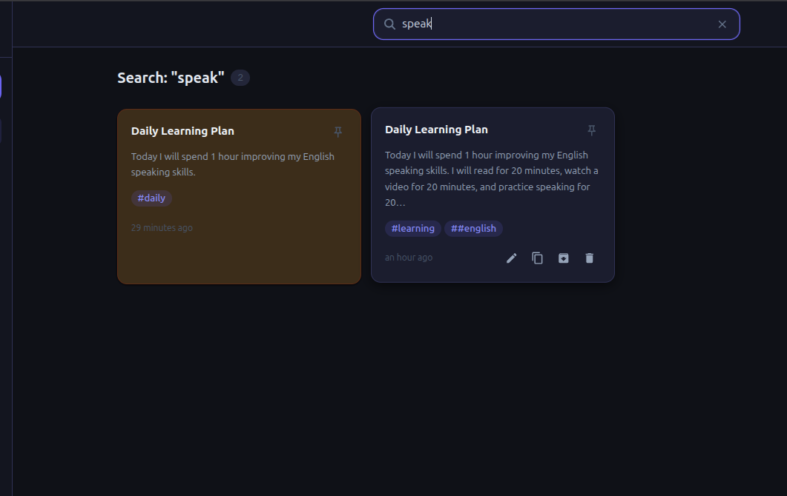
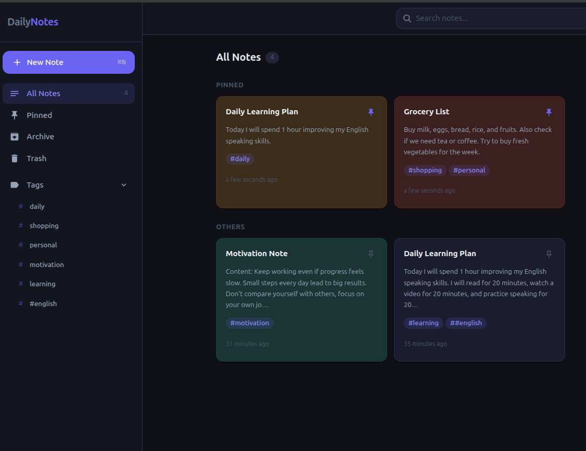
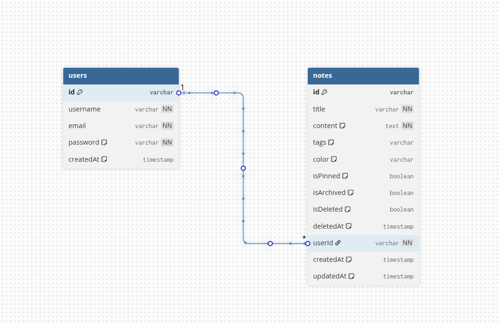
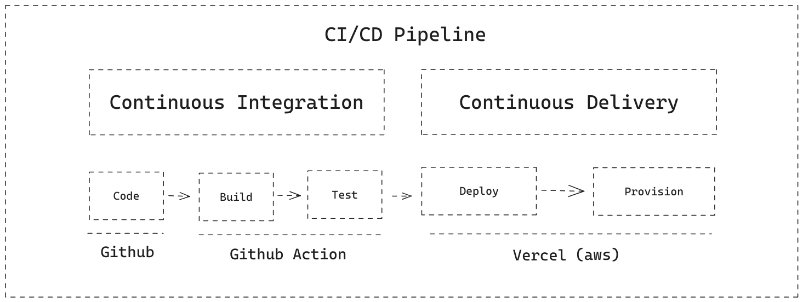

# DailyNotes

**Live Demo:** [DailyNotes Web Application](https://dailynotes-alikhere.vercel.app)

## Overview

**DailyNotes** is a modern, full-stack note-taking application built with the **MERN Stack** (MongoDB, Express, React, Node.js). It features a premium dark-mode UI, markdown support, tag-based organization, and a complete note lifecycle (archive, trash, restore).

## Getting Started

Run DailyNotes locally using either of the following methods:
- [Setup Instructions](/Setup-Instruction.md)
- [Docker Instructions](/Docker-Instruction.md)

---

## Features

### Core
- **User Authentication** — Secure JWT-based sign up and sign in (fast async bcrypt)
- **Create, Edit, Delete Notes** — Full CRUD with client-side validation
- **Pin Notes** — Keep important notes pinned at the top
- **Search Notes** — Full-text search across title, content, and tags (trigger with Enter or click)

### Organization
- **Tags System** — Add tags to notes; filter notes by tag from the sidebar
- **Archive** — Move notes out of the main view without deleting them
- **Trash & Restore** — Soft delete with trash bin; restore or permanently delete
- **Note Color Coding** — 9 color options per note (Default, Red, Orange, Yellow, Green, Teal, Blue, Purple, Pink)
- **Note Duplication** — Clone any note with one click

### Editor
- **Markdown Editor** — Write tab with monospace editor + Preview tab with rendered output
- **Markdown Rendering** — Supports headers, bold, italic, code blocks, lists, blockquotes, and links

### UX & Navigation
- **Dark Mode by Default** — Full dark/light toggle, preference persisted in localStorage
- **Sidebar Navigation** — All Notes, Pinned, Tags (expandable), Archive, Trash
- **Keyboard Shortcuts** — Use Ctrl+N / Cmd+N to create a new note, Ctrl+K / Cmd+K to focus search, Ctrl+S / Cmd+S to save the note, and Esc to close modals or clear search.
- **Sort Options** — Newest, Oldest, Last Updated, Title A→Z, Title Z→A
- **Relative Timestamps** — "2 hours ago", "yesterday", etc. (exact date on hover)

---

## Screenshots

| Auth Page | Note Editor with Markdown |
|-----------|---------------------------|
|  |  |

| Note Search | Pinned, Archive & Trash Features |
|-------------|----------------------------------|
|  |  |

---

## Tech Stack

| Layer | Technology |
|---|---|
| Frontend | React 19, Vite, Tailwind CSS |
| State Management | Redux Toolkit + Redux Persist |
| Backend | Node.js, Express.js |
| Database | MongoDB + Mongoose |
| Auth | JWT (httpOnly cookies), bcryptjs (async) |
| Routing | React Router DOM v7 |
| HTTP Client | Axios |
| Notifications | React Toastify |
| Dates | Moment.js |
| Containerization | Docker + Docker Compose |

---

## Database Schema

## CI/CD Pipeline

